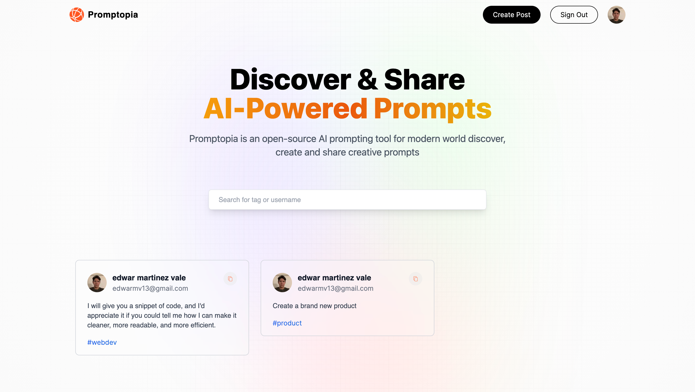
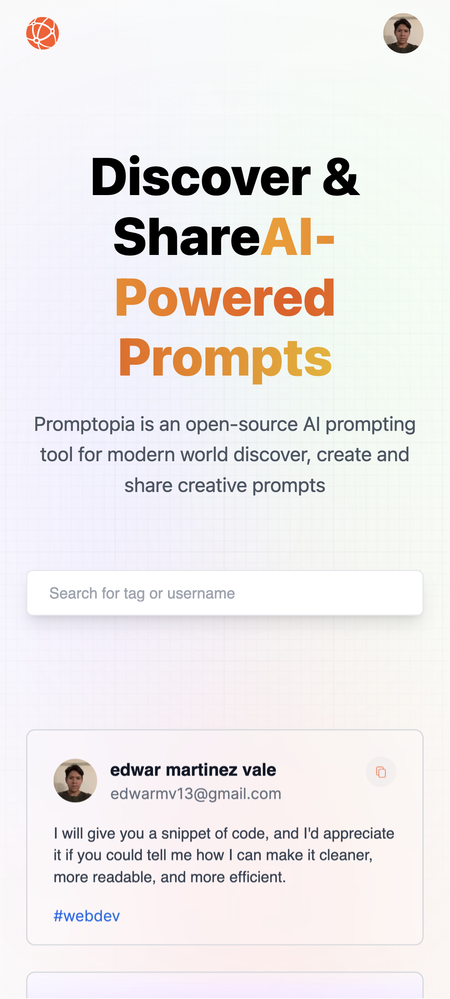

## This Project Is Part Of A Next.js Course

from [JavaScript Mastery](https://youtu.be/wm5gMKuwSYk)

This project if for create and share AI-Powered prompts, we use next-auth to get authenticated by Google and we connect to mongodb cloud to store the user prompts.

## Screenshots

Desktop

Mobile

